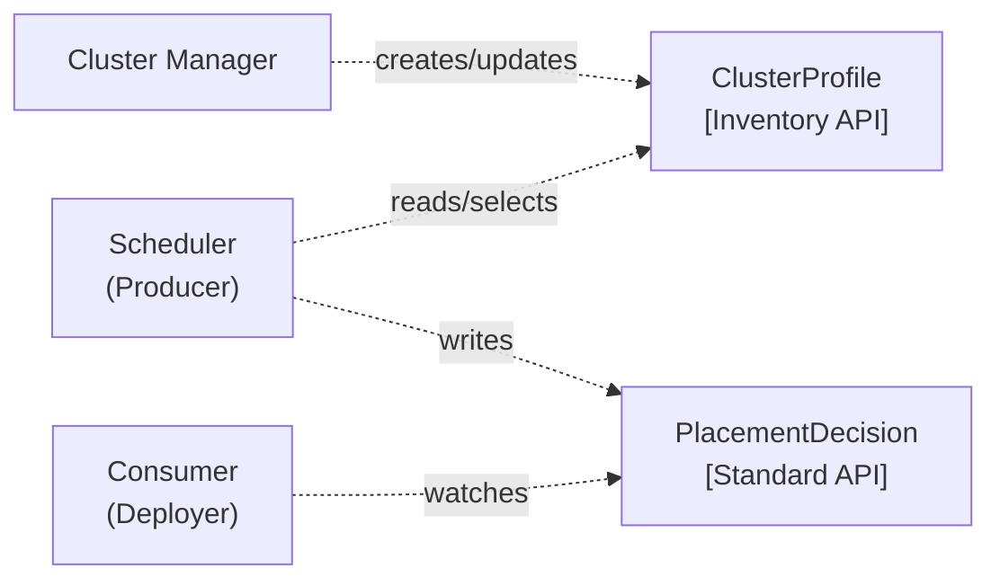

# PlacementDecision API Adoption Guide

The [PlacementDecision API](https://github.com/kubernetes/enhancements/blob/master/keps/sig-multicluster/5313-placement-decision-api/README.md)
(KEP-5313) gives schedulers a standard way to publish which clusters were chosen for a workload,
and gives consumers a single API to watch instead of integrating with each scheduler individually.

A `PlacementDecision` is a **data-only**, namespace-scoped resource. Schedulers **write** it;
consumers **read** it. Each object holds up to 100 cluster decisions, following the
[EndpointSlice](https://kubernetes.io/docs/concepts/services-networking/endpoint-slices/) convention.



## Table of Contents

- [Prerequisites](#prerequisites)
- [For Producers (Scheduler Implementers)](#for-producers-scheduler-implementers)
  - [Creating a PlacementDecision](#creating-a-placementdecision)
  - [Multi-Slice Pattern](#multi-slice-pattern)
  - [Lifecycle Management](#lifecycle-management)
- [For Consumers (Workload Deployers)](#for-consumers-workload-deployers)
  - [Watching PlacementDecisions](#watching-placementdecisions)
  - [Resolving Clusters](#resolving-clusters)
  - [Reacting to Decision Changes](#reacting-to-decision-changes)
  - [Integration Patterns](#integration-patterns)
- [End-to-End Walkthrough](#end-to-end-walkthrough)
- [References](#references)

---

## Prerequisites

### Install the CRDs

```bash
kubectl apply -f config/crd/bases/multicluster.x-k8s.io_clusterprofiles.yaml
kubectl apply -f config/crd/bases/multicluster.x-k8s.io_placementdecisions.yaml
```

### Add the Go dependency

```bash
go get sigs.k8s.io/cluster-inventory-api@latest
```

### Import the generated clientset

```go
import (
    ciaclient "sigs.k8s.io/cluster-inventory-api/client/clientset/versioned"
    cpv1alpha1 "sigs.k8s.io/cluster-inventory-api/apis/v1alpha1"
)
```

Build a client from an existing `rest.Config`:

```go
client, err := ciaclient.NewForConfig(restConfig)
if err != nil {
    log.Fatalf("failed to create client: %v", err)
}
```

---

## For Producers (Scheduler Implementers)

Producers are schedulers that examine `ClusterProfile` objects in the fleet, select a subset
of clusters, and publish the result as one or more `PlacementDecision` objects.

### Creating a PlacementDecision

A minimal PlacementDecision references chosen clusters via `clusterProfileRef` and identifies
the producing scheduler via `schedulerName`:

**YAML**

```yaml
apiVersion: multicluster.x-k8s.io/v1alpha1
kind: PlacementDecision
metadata:
  name: my-app-decision
  namespace: scheduling
  labels:
    multicluster.x-k8s.io/placement-key: "my-app"
schedulerName: my-scheduler
decisions:
- clusterProfileRef:
    name: cluster-us-west
  reason: "Lowest latency"
- clusterProfileRef:
    name: cluster-eu-central
    namespace: fleet-eu
  reason: "GDPR compliance"
```

**Go**

```go
decision := &cpv1alpha1.PlacementDecision{
    ObjectMeta: metav1.ObjectMeta{
        Name:      "my-app-decision",
        Namespace: "scheduling",
        Labels: map[string]string{
            cpv1alpha1.PlacementKeyLabel: "my-app",
        },
    },
    Decisions: []cpv1alpha1.ClusterDecision{
        {
            ClusterProfileRef: cpv1alpha1.ClusterProfileReference{
                Name: "cluster-us-west",
            },
            Reason: "Lowest latency",
        },
        {
            ClusterProfileRef: cpv1alpha1.ClusterProfileReference{
                Name:      "cluster-eu-central",
                Namespace: "fleet-eu",
            },
            Reason: "GDPR compliance",
        },
    },
    SchedulerName: "my-scheduler",
}

created, err := client.ApisV1alpha1().PlacementDecisions("scheduling").Create(
    ctx, decision, metav1.CreateOptions{},
)
```

Key fields:

- **`decisions[].clusterProfileRef.name`** (required) — Name of the target `ClusterProfile`.
- **`decisions[].clusterProfileRef.namespace`** (optional) — Namespace of the `ClusterProfile`. If omitted, defaults to the PlacementDecision's own namespace.
- **`decisions[].reason`** (optional) — Human-readable explanation for audit and debugging.
- **`schedulerName`** (optional) — Identifies which scheduler produced this decision.

### Multi-Slice Pattern

Each `PlacementDecision` holds at most **100** cluster decisions (enforced by the CRD schema).
When a placement selects more than 100 clusters, split the results across multiple
PlacementDecision objects — called **slices** — following the same convention as
[EndpointSlice](https://kubernetes.io/docs/concepts/services-networking/endpoint-slices/).

#### Label conventions

- **`multicluster.x-k8s.io/decision-key`** — **MUST** be set on all slices when more than one slice exists. This groups slices into one logical decision.
- **`multicluster.x-k8s.io/decision-index`** — Set when ordering matters. The value starts at `0` and increments by `1` for each slice.
- **`multicluster.x-k8s.io/placement-key`** — Set when the decision is workload-scoped. This links the decision back to the originating workload.

#### Example: 150 clusters across two slices

**Slice 0** (clusters 0–99):

```yaml
apiVersion: multicluster.x-k8s.io/v1alpha1
kind: PlacementDecision
metadata:
  name: batch-job-decision-0
  namespace: scheduling
  labels:
    multicluster.x-k8s.io/decision-key: "batch-job-decision"
    multicluster.x-k8s.io/decision-index: "0"
    multicluster.x-k8s.io/placement-key: "batch-job-run-42"
schedulerName: gpu-scheduler
decisions:
- clusterProfileRef:
    name: cluster-0
  reason: "GPU available"
- clusterProfileRef:
    name: cluster-1
  reason: "GPU available"
# ... up to 100 entries
```

**Slice 1** (clusters 100–149):

```yaml
apiVersion: multicluster.x-k8s.io/v1alpha1
kind: PlacementDecision
metadata:
  name: batch-job-decision-1
  namespace: scheduling
  labels:
    multicluster.x-k8s.io/decision-key: "batch-job-decision"
    multicluster.x-k8s.io/decision-index: "1"
    multicluster.x-k8s.io/placement-key: "batch-job-run-42"
schedulerName: gpu-scheduler
decisions:
- clusterProfileRef:
    name: cluster-100
# ... up to 50 entries
```

**Go — creating slices programmatically:**

```go
const maxDecisionsPerSlice = 100

func createDecisionSlices(
    ctx context.Context,
    client ciaclient.Interface,
    namespace, decisionKey, placementKey, schedulerName string,
    allDecisions []cpv1alpha1.ClusterDecision,
) error {
    for i := 0; i < len(allDecisions); i += maxDecisionsPerSlice {
        end := i + maxDecisionsPerSlice
        if end > len(allDecisions) {
            end = len(allDecisions)
        }
        sliceIndex := i / maxDecisionsPerSlice

        slice := &cpv1alpha1.PlacementDecision{
            ObjectMeta: metav1.ObjectMeta{
                Name:      fmt.Sprintf("%s-%d", decisionKey, sliceIndex),
                Namespace: namespace,
                Labels: map[string]string{
                    cpv1alpha1.DecisionKeyLabel:   decisionKey,
                    cpv1alpha1.DecisionIndexLabel: fmt.Sprintf("%d", sliceIndex),
                    cpv1alpha1.PlacementKeyLabel:  placementKey,
                },
            },
            Decisions:     allDecisions[i:end],
            SchedulerName: schedulerName,
        }

        _, err := client.ApisV1alpha1().PlacementDecisions(namespace).Create(
            ctx, slice, metav1.CreateOptions{},
        )
        if err != nil {
            return fmt.Errorf("failed to create slice %d: %w", sliceIndex, err)
        }
    }
    return nil
}
```

### Lifecycle Management

#### Updating decisions (reschedule)

When scheduling changes, update the existing `PlacementDecision`. If the cluster count
crosses the 100-entry boundary, create or delete slices as needed.

```go
// Fetch, modify, update
existing, err := client.ApisV1alpha1().PlacementDecisions(ns).Get(ctx, name, metav1.GetOptions{})
if err != nil {
    return err
}

updated := existing.DeepCopy()
updated.Decisions = append(updated.Decisions, cpv1alpha1.ClusterDecision{
    ClusterProfileRef: cpv1alpha1.ClusterProfileReference{Name: "cluster-new"},
    Reason:            "Scaled up",
})

_, err = client.ApisV1alpha1().PlacementDecisions(ns).Update(ctx, updated, metav1.UpdateOptions{})
```

> **Tip:** If heavy churn is a concern, sort the `decisions` slice alphabetically by cluster name before comparing/updating. Stable ordering makes it easier to detect no-op changes and skip unnecessary updates (which would otherwise generate watch events).

#### Cleanup

When the originating placement request is deleted, delete all related slices:

```go
// Delete all slices for a decision-key
err := client.ApisV1alpha1().PlacementDecisions(ns).DeleteCollection(
    ctx,
    metav1.DeleteOptions{},
    metav1.ListOptions{
        LabelSelector: fmt.Sprintf("%s=%s", cpv1alpha1.DecisionKeyLabel, decisionKey),
    },
)
```

#### Owner references

Set `ownerReferences` on PlacementDecision objects to tie their lifecycle to the originating
placement request. When the parent is deleted, Kubernetes garbage-collects the decisions:

```go
decision.OwnerReferences = []metav1.OwnerReference{
    {
        APIVersion: "your-scheduler.io/v1",
        Kind:       "PlacementRequest",
        Name:       placementRequest.Name,
        UID:        placementRequest.UID,
    },
}
```

#### RBAC

Grant the scheduler write access and consumers read-only access:

```yaml
# Scheduler (producer) role
apiVersion: rbac.authorization.k8s.io/v1
kind: ClusterRole
metadata:
  name: placementdecision-writer
rules:
- apiGroups: ["multicluster.x-k8s.io"]
  resources: ["placementdecisions"]
  verbs: ["create", "update", "patch", "delete", "deletecollection", "get", "list", "watch"]

---
# Consumer role
apiVersion: rbac.authorization.k8s.io/v1
kind: ClusterRole
metadata:
  name: placementdecision-reader
rules:
- apiGroups: ["multicluster.x-k8s.io"]
  resources: ["placementdecisions"]
  verbs: ["get", "list", "watch"]
```

---

## For Consumers (Workload Deployers)

Consumers are controllers that watch `PlacementDecision` objects and act on them —
deploying workloads, configuring monitoring, scheduling jobs, etc.

### Watching PlacementDecisions

**Filter by label selector** (recommended):

```go
// Watch all decisions for a specific workload
watcher, err := client.ApisV1alpha1().PlacementDecisions(namespace).Watch(ctx, metav1.ListOptions{
    LabelSelector: fmt.Sprintf("%s=%s", cpv1alpha1.PlacementKeyLabel, "my-app"),
})
```

**Filter by schedulerName:**

```go
// List and filter by scheduler
list, err := client.ApisV1alpha1().PlacementDecisions(namespace).List(ctx, metav1.ListOptions{})
if err != nil {
    return err
}
for _, pd := range list.Items {
    if pd.SchedulerName == "my-scheduler" {
        // process this decision
    }
}
```

#### Correlating multi-slice decisions

When a decision spans multiple slices, collect all slices by `decision-key` and sort
by `decision-index`:

```go
import "sort"
import "strconv"

func collectDecisions(
    ctx context.Context,
    client ciaclient.Interface,
    namespace, decisionKey string,
) ([]cpv1alpha1.ClusterDecision, error) {
    list, err := client.ApisV1alpha1().PlacementDecisions(namespace).List(ctx, metav1.ListOptions{
        LabelSelector: fmt.Sprintf("%s=%s", cpv1alpha1.DecisionKeyLabel, decisionKey),
    })
    if err != nil {
        return nil, err
    }

    // Sort slices by decision-index
    sort.Slice(list.Items, func(i, j int) bool {
        idxI, errI := strconv.Atoi(list.Items[i].Labels[cpv1alpha1.DecisionIndexLabel])
        idxJ, errJ := strconv.Atoi(list.Items[j].Labels[cpv1alpha1.DecisionIndexLabel])
        if errI != nil || errJ != nil {
            return list.Items[i].Name < list.Items[j].Name
        }
        return idxI < idxJ
    })

    var all []cpv1alpha1.ClusterDecision
    for _, slice := range list.Items {
        all = append(all, slice.Decisions...)
    }
    return all, nil
}
```

### Resolving Clusters

Each `clusterProfileRef` points to a `ClusterProfile`. Use `pkg/access.BuildConfigFromCP()`
to turn a `ClusterProfile` into a `rest.Config` you can use with client-go:

```go
import "sigs.k8s.io/cluster-inventory-api/pkg/access"

// Load the access provider configuration
accessCfg, err := access.NewFromFile("clusterprofile-provider-file.json")
if err != nil {
    log.Fatalf("failed to load access config: %v", err)
}

// For each decided cluster, resolve to a live connection
for _, d := range decision.Decisions {
    cpNamespace := d.ClusterProfileRef.Namespace
    if cpNamespace == "" {
        cpNamespace = decision.Namespace // default to PlacementDecision's namespace
    }

    // Fetch the ClusterProfile
    cp, err := client.ApisV1alpha1().ClusterProfiles(cpNamespace).Get(
        ctx, d.ClusterProfileRef.Name, metav1.GetOptions{},
    )
    if err != nil {
        log.Printf("failed to get ClusterProfile %s/%s: %v", cpNamespace, d.ClusterProfileRef.Name, err)
        continue
    }

    // Build a rest.Config for this cluster
    spokeConfig, err := accessCfg.BuildConfigFromCP(cp)
    if err != nil {
        log.Printf("failed to build config for %s: %v", cp.Name, err)
        continue
    }

    // Now use spokeConfig with any client-go client
    spokeClient, err := kubernetes.NewForConfig(spokeConfig)
    if err != nil {
        log.Printf("failed to create spoke client for %s: %v", cp.Name, err)
        continue
    }

    // Deploy workloads to this cluster...
}
```

### Reacting to Decision Changes

When a `PlacementDecision` is updated, diff old vs new decisions to figure out which
clusters were added or removed:

```go
func diffDecisions(
    defaultNamespace string,
    oldDecisions, newDecisions []cpv1alpha1.ClusterDecision,
) (added, removed []cpv1alpha1.ClusterDecision) {
    keyFn := func(d cpv1alpha1.ClusterDecision) string {
        ns := d.ClusterProfileRef.Namespace
        if ns == "" {
            ns = defaultNamespace
        }
        return ns + "/" + d.ClusterProfileRef.Name
    }

    oldSet := make(map[string]bool)
    for _, d := range oldDecisions {
        oldSet[keyFn(d)] = true
    }

    newSet := make(map[string]bool)
    for _, d := range newDecisions {
        key := keyFn(d)
        newSet[key] = true
        if !oldSet[key] {
            added = append(added, d)
        }
    }

    for _, d := range oldDecisions {
        if !newSet[keyFn(d)] {
            removed = append(removed, d)
        }
    }
    return
}
```

Use this diff to:
- **Added clusters**: Deploy workloads to the new clusters
- **Removed clusters**: Clean up workloads from clusters no longer in the decision

### Integration Patterns

**GitOps** (e.g., Argo CD, Flux) — Watch `PlacementDecision` objects. For each decided cluster, generate an `Application` or `Kustomization` targeting that cluster. When clusters are removed from the decision, delete the corresponding application.

**Batch / AI-ML** (e.g., MultiKueue) — Watch decisions labeled with the job's `placement-key`. Dispatch work items to decided clusters. Rebalance if the decision is updated.

**Operator deployment** — Watch decisions to determine which clusters need an operator installed. Deploy the operator's manifests to added clusters; uninstall from removed clusters.

---

## End-to-End Walkthrough

This walkthrough ties `ClusterProfile` and `PlacementDecision` together in a complete flow.

### Step 1: Cluster manager creates ClusterProfiles

A cluster manager registers clusters in the inventory:

```yaml
apiVersion: multicluster.x-k8s.io/v1alpha1
kind: ClusterProfile
metadata:
  name: cluster-us-west
  namespace: fleet
spec:
  displayName: "US West Production"
  clusterManager:
    name: my-fleet-manager
# Note: status is typically managed via the /status subresource (set by controllers); shown here for illustration.
status:
  version:
    kubernetes: "1.31.0"
  conditions:
  - type: ControlPlaneHealthy
    status: "True"
    lastTransitionTime: "2025-01-01T00:00:00Z"
  properties:
  - name: gpu.available
    value: "true"
  accessProviders:
  - name: my-auth-provider
    cluster:
      server: https://us-west.example.com:6443
      certificateAuthorityData: <base64-ca-data>
---
apiVersion: multicluster.x-k8s.io/v1alpha1
kind: ClusterProfile
metadata:
  name: cluster-eu-central
  namespace: fleet
spec:
  displayName: "EU Central Production"
  clusterManager:
    name: my-fleet-manager
# Note: status is typically managed via the /status subresource (set by controllers); shown here for illustration.
status:
  version:
    kubernetes: "1.31.0"
  conditions:
  - type: ControlPlaneHealthy
    status: "True"
    lastTransitionTime: "2025-01-01T00:00:00Z"
  accessProviders:
  - name: my-auth-provider
    cluster:
      server: https://eu-central.example.com:6443
      certificateAuthorityData: <base64-ca-data>
```

### Step 2: Scheduler selects clusters and writes a PlacementDecision

The scheduler examines `ClusterProfile` objects, applies its scheduling logic (e.g., GPU
availability, region, health), and publishes a `PlacementDecision`:

```go
// List all ClusterProfiles
profiles, err := client.ApisV1alpha1().ClusterProfiles("fleet").List(ctx, metav1.ListOptions{})
if err != nil {
    log.Fatalf("failed to list ClusterProfiles: %v", err)
}

// Apply scheduling logic — select clusters with GPUs
var selected []cpv1alpha1.ClusterDecision
for _, cp := range profiles.Items {
    for _, prop := range cp.Status.Properties {
        if prop.Name == "gpu.available" && prop.Value == "true" {
            selected = append(selected, cpv1alpha1.ClusterDecision{
                ClusterProfileRef: cpv1alpha1.ClusterProfileReference{
                    Name:      cp.Name,
                    Namespace: cp.Namespace,
                },
                Reason: "GPU available",
            })
        }
    }
}

// Publish the decision
decision := &cpv1alpha1.PlacementDecision{
    ObjectMeta: metav1.ObjectMeta{
        Name:      "gpu-workload-decision",
        Namespace: "fleet",
        Labels: map[string]string{
            cpv1alpha1.PlacementKeyLabel: "gpu-training-job",
        },
    },
    Decisions:     selected,
    SchedulerName: "gpu-scheduler",
}

_, err = client.ApisV1alpha1().PlacementDecisions("fleet").Create(ctx, decision, metav1.CreateOptions{})
if err != nil {
    log.Fatalf("failed to create PlacementDecision: %v", err)
}
```

### Step 3: Consumer watches the decision and deploys workloads

The consumer watches `PlacementDecision` objects and deploys a ConfigMap to each decided
cluster as a simple example:

```go
import (
    "sigs.k8s.io/cluster-inventory-api/pkg/access"
    k8sclient "k8s.io/client-go/kubernetes"
    apierrors "k8s.io/apimachinery/pkg/api/errors"
)

// Load access provider config
accessCfg, err := access.NewFromFile("clusterprofile-provider-file.json")
if err != nil {
    log.Fatalf("failed to load access config: %v", err)
}

// Watch PlacementDecisions for our workload
watcher, err := client.ApisV1alpha1().PlacementDecisions("fleet").Watch(ctx, metav1.ListOptions{
    LabelSelector: fmt.Sprintf("%s=%s", cpv1alpha1.PlacementKeyLabel, "gpu-training-job"),
})
if err != nil {
    log.Fatalf("failed to watch: %v", err)
}

for event := range watcher.ResultChan() {
    pd, ok := event.Object.(*cpv1alpha1.PlacementDecision)
    if !ok {
        continue
    }

    for _, d := range pd.Decisions {
        cpNamespace := d.ClusterProfileRef.Namespace
        if cpNamespace == "" {
            cpNamespace = pd.Namespace
        }

        // Resolve ClusterProfile → rest.Config
        cp, err := client.ApisV1alpha1().ClusterProfiles(cpNamespace).Get(
            ctx, d.ClusterProfileRef.Name, metav1.GetOptions{},
        )
        if err != nil {
            log.Printf("skip %s: %v", d.ClusterProfileRef.Name, err)
            continue
        }

        spokeConfig, err := accessCfg.BuildConfigFromCP(cp)
        if err != nil {
            log.Printf("skip %s: %v", cp.Name, err)
            continue
        }

        spokeClient, err := k8sclient.NewForConfig(spokeConfig)
        if err != nil {
            log.Printf("skip %s: %v", cp.Name, err)
            continue
        }

        // Deploy a ConfigMap to the decided cluster
        cm := &corev1.ConfigMap{
            ObjectMeta: metav1.ObjectMeta{
                Name:      "deployed-by-decision",
                Namespace: "default",
            },
            Data: map[string]string{
                "scheduler": pd.SchedulerName,
                "reason":    d.Reason,
            },
        }

        _, err = spokeClient.CoreV1().ConfigMaps("default").Create(ctx, cm, metav1.CreateOptions{})
        if err != nil && !apierrors.IsAlreadyExists(err) {
            log.Printf("failed to deploy to %s: %v", cp.Name, err)
        } else if err == nil {
            log.Printf("deployed ConfigMap to cluster %s", cp.Name)
        }
    }
}
```

---

