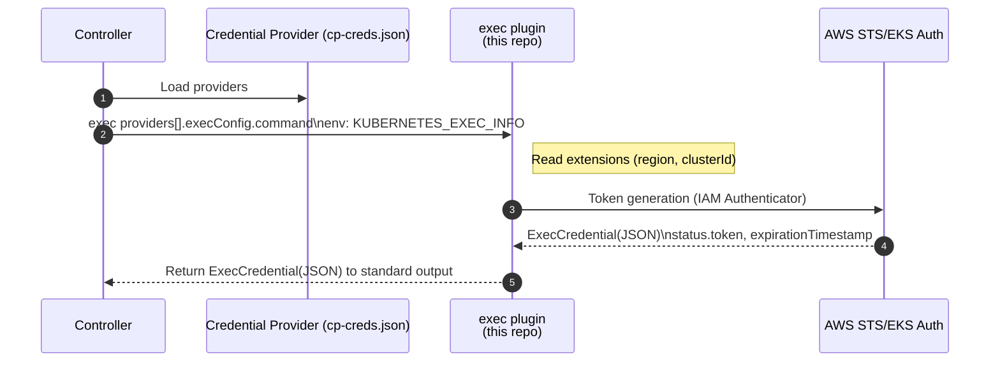

# EKS AWS Auth Plugin

When executed by a controller, this plugin reads `region` and `clusterId` from the exec extensions (`ExecCredential.Spec.Cluster.Config`), obtains an EKS token via the AWS IAM Authenticator token generator, and writes an ExecCredential (JSON) to stdout.

See also:

- Credential plugin library: [`pkg/credentialplugin`](../../../../pkg/credentialplugin)

## Required IAM Policies

This plugin uses the AWS IAM Authenticator token generator which relies on STS (`GetCallerIdentity`) under the hood. No explicit EKS permissions are required.

If you prefer to provide an explicit policy, you can use:

```json
{
  "Version": "2012-10-17",
  "Statement": [
    {
      "Sid": "AllowSTSGetCallerIdentity",
      "Effect": "Allow",
      "Action": [
        "sts:GetCallerIdentity"
      ],
      "Resource": "*"
    }
  ]
}
```

Note: Organizations SCPs or explicit Deny statements may still affect STS. Ensure your runtime environment can call `sts:GetCallerIdentity`.

## Build

```bash
go build -o ./bin/eks-aws-auth-plugin ./plugins/eks-aws-auth-plugin/cmd/plugin
```

## Usage in a controller

Use the following provider config to exec the eks-aws-auth plugin.

```jsonc
{
  "providers": [
    {
      "name": "eks",
      "execConfig": {
        "apiVersion": "client.authentication.k8s.io/v1beta1",
        "command": "./bin/eks-aws-auth-plugin",
        "provideClusterInfo": true
      }
    }
  ]
}
```

### Note: `ClusterProfile.status.accessProviders[].cluster.extensions`

- Required: set `extensions[].name` to `client.authentication.k8s.io/exec`.
- The library reads only the `extension` field of that entry and passes it through to `ExecCredential.Spec.Cluster.Config`.
- The `eks-aws-auth-plugin` uses `region` and `clusterId` inside that Config.

Example:

```yaml
status:
  accessProviders:
  - name: eks
    cluster:
      server: https://xxx.gr7.ap-northeast-1.eks.amazonaws.com
      certificate-authority-data: <BASE64_CA>
      extensions:
      - name: client.authentication.k8s.io/exec
        extension:
          region: ap-northeast-1
          clusterId: my-eks-cluster
```

## Architecture

### Overall Flow (Mermaid)



## Troubleshooting

- `missing ExecCredential.Spec.Cluster.Config (extensions)` → Ensure `client.authentication.k8s.io/exec` extension is present with `region` and `clusterId`.
- `KUBERNETES_EXEC_INFO is empty` → Check if `provideClusterInfo: true` is configured.
